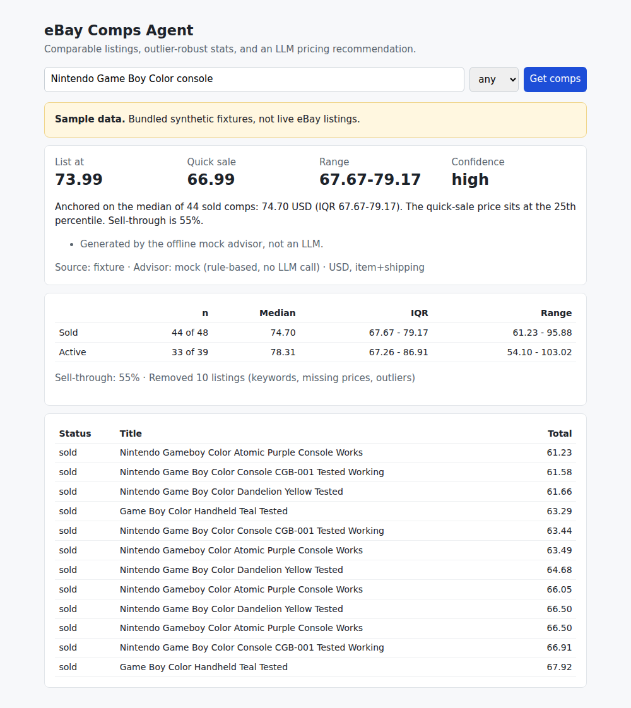

# eBay Comps Agent

Price an item the way a reseller does: pull comparable eBay listings, throw out the junk, look
at the distribution, and get a list price with reasoning you can check.

[](https://github.com/mikecavallo/ebayCompsAgent/actions/workflows/ci.yml)

## What it does

Given an item description (for example `"Canon AE-1 Program 35mm camera"`):

1. **Fetches comparables** from eBay's official REST APIs: active fixed-price listings from the
   [Browse API](https://developer.ebay.com/api-docs/buy/browse/overview.html), and, if your app
   has been granted access, sold items from the
   [Marketplace Insights API](https://developer.ebay.com/api-docs/buy/marketplace-insights/overview.html).
2. **Cleans them**: drops listings with no price, other currencies, titles that signal a
   different product ("for parts", "lot of", "box only", ...; skipped when your query itself
   says "for parts"), and Tukey-fence outliers (1.5 x IQR), computed separately for sold and
   active prices.
3. **Computes stats** on the buyer's landed price (item + shipping, or item only with
   `--item-price-only`): count, median, IQR, range, and sell-through
   (`sold / (sold + active)`) when sold data is available.
4. **Asks an LLM for a recommendation** using structured output: Claude by default
   (`claude-sonnet-5-5` via `messages.parse` with a Pydantic schema), OpenAI optional (Responses
   API with `text_format`). The model returns list price, quick-sale price, range, confidence,
   reasoning, and caveats, and is told to treat active prices as asking prices, not sales.
5. **Exports** the kept comps to CSV or Airtable (optional).

Everything also runs **offline**: bundled sample fixtures stand in for eBay and a rule-based
mock advisor stands in for the LLM, so you can try it, and CI can test it, with no keys.

## Important: sold prices and eBay API access

Sold prices are the best pricing evidence, but eBay only exposes them through the
**Marketplace Insights API, which is restricted** to applications eBay approves. Without it,
this tool works from **active listings only** (asking prices), reports sell-through as `n/a`,
and the advisor is instructed to say so and lower its confidence. Set
`EBAY_USE_MARKETPLACE_INSIGHTS=1` only after eBay grants your app that scope.

This project deliberately does **not** scrape eBay's HTML (the 2023 version did; see
[`legacy/`](legacy/README.md)). Scraping is against eBay's user agreement and breaks whenever
the markup changes.

## Sample output

> The output below is generated from the **bundled synthetic fixtures** with the mock advisor
> (`--demo`). The listings and prices are made-up sample data, not real eBay results.

```text
$ ebay-comps --demo "Nintendo Game Boy Color console" --condition used
*** SAMPLE DATA: bundled synthetic fixtures, not live eBay listings ***
Comps for: Nintendo Game Boy Color console  (condition: used)
Source: fixture   Advisor: mock (rule-based, no LLM call)
Prices in USD, basis: item+shipping

Statistics (after cleaning)
  Sold    n=44 of 46    median    74.70   IQR 67.67-79.17   range 61.23-95.88
  Active  n=33 of 38    median    78.31   IQR 67.26-86.91   range 54.10-103.02
  Sell-through: 55% (sold / (sold + active))
  Removed 7 listings: 1 no price, 2 outlier, 1 title contains 'box only', 1 title
    contains 'for parts', 1 title contains 'lot of', 1 title contains 'replacement
    shell'

Recommendation
  List at:     73.99
  Quick sale:  66.99
  Range:       67.67 - 79.17
  Confidence:  high
  Anchored on the median of 44 sold comps: 74.70 USD (IQR 67.67-79.17). The quick-sale
  price sits at the 25th percentile. Sell-through is 55%.
  - Generated by the offline mock advisor, not an LLM.

Top comps (of 77 kept)
  sold   2026-07-21    61.23  Nintendo Gameboy Color Atomic Purple Console Works
  sold   2026-07-08    61.58  Nintendo Game Boy Color Console CGB-001 Tested Working
  sold   2026-08-18    61.66  Nintendo Game Boy Color Dandelion Yellow Tested
  sold   2026-08-25    63.29  Game Boy Color Handheld Teal Tested
  sold   2026-08-05    63.44  Nintendo Game Boy Color Console CGB-001 Tested Working
  sold   2026-07-07    63.49  Nintendo Gameboy Color Atomic Purple Console Works
  sold   2026-07-20    64.68  Nintendo Game Boy Color Dandelion Yellow Tested
  sold   2026-08-29    66.05  Nintendo Gameboy Color Atomic Purple Console Works
```

With real keys, the same command (without `--demo`) queries eBay and the reasoning and caveats
come from Claude instead of the rule-based mock.

Web UI (`uvicorn ebay_comps.web:app`), also on sample data:



## Quick start

Requires Python 3.10+.

```bash
git clone https://github.com/mikecavallo/ebayCompsAgent.git
cd ebayCompsAgent
python -m venv .venv && source .venv/bin/activate
pip install -e ".[web]"            # add ,openai and/or ,airtable as needed

# Offline demo: sample fixtures + mock advisor, no keys needed
ebay-comps --demo "Nintendo Game Boy Color console"
ebay-comps --demo "canon ae-1 program" --json

# Live: copy .env.example, fill in keys, export them, then
ebay-comps "Canon AE-1 Program 35mm camera" --condition used --csv comps.csv

# Web UI at http://localhost:8000
uvicorn ebay_comps.web:app
```

The demo fixtures cover two items: `nintendo-game-boy-color-console` and
`canon-ae-1-program-35mm-film-camera`. Other queries in demo mode exit with a clear error rather
than returning unrelated data.

## CLI options

| Option | Default | Meaning |
| --- | --- | --- |
| `--condition any\|new\|used` | `any` | Maps to eBay condition IDs 1000 (new) / 3000 (used) |
| `--limit N` | 100 | Listings per search (eBay max 200) |
| `--source auto\|ebay\|fixture` | `auto` | `auto` uses eBay when `EBAY_CLIENT_ID`/`SECRET` are set, else fixtures |
| `--llm auto\|anthropic\|openai\|mock` | `auto` | `auto` picks Anthropic, then OpenAI, then mock, by which key is set |
| `--demo` | | Shortcut for `--source fixture --llm mock` |
| `--item-price-only` | | Exclude shipping from the price basis |
| `--json` | | Print the full report (stats, removed listings, comps, recommendation) |
| `--csv PATH` | | Write kept comps to CSV |
| `--airtable` | | Upsert kept comps to Airtable, keyed on Item ID |

Every report states its source, advisor, and whether it is sample data.

## Environment variables

See [`.env.example`](.env.example). Nothing is hardcoded.

| Variable | Used for |
| --- | --- |
| `EBAY_CLIENT_ID`, `EBAY_CLIENT_SECRET` | eBay app keyset; OAuth client-credentials grant |
| `EBAY_ENV` | `production` (default) or `sandbox` |
| `EBAY_MARKETPLACE_ID` | Default `EBAY_US` |
| `EBAY_USE_MARKETPLACE_INSIGHTS` | `1` to fetch sold data (restricted API, see above) |
| `ANTHROPIC_API_KEY`, `ANTHROPIC_MODEL` | Claude advisor; model defaults to `claude-sonnet-5-5` |
| `OPENAI_API_KEY`, `OPENAI_MODEL` | OpenAI advisor (`pip install -e ".[openai]"`); model defaults to `gpt-5` |
| `AIRTABLE_API_KEY`, `AIRTABLE_BASE_ID`, `AIRTABLE_TABLE_NAME` | Airtable export (`.[airtable]`); table defaults to `Comps` |

For Airtable, create a table with the columns `Item ID`, `Query`, `Status`, `Title`, `Price`,
`Shipping`, `Total Price`, `Currency`, `Condition`, `Sold Date`, `URL`. Re-running a search
updates existing rows instead of duplicating them.

## Architecture

```text
src/ebay_comps/
  providers/   ListingSource implementations
    ebay.py      Browse API + optional Marketplace Insights, OAuth token cache
    fixture.py   Offline source reading bundled JSON fixtures (synthetic, API-shaped)
  stats.py     Cleaning (keywords, currency, IQR outliers), summary stats, sell-through
  llm/         Advisor implementations, all returning a PricingRecommendation
    anthropic_advisor.py   Claude structured output (default)
    openai_advisor.py      OpenAI structured output
    mock_advisor.py        Deterministic rule-based fallback, no API call
  agent.py     run_comps(): fetch -> clean -> stats -> advisor -> CompsReport
  cli.py, render.py, web.py, export.py
tests/         Offline tests: HTTP mocked with respx, LLM clients faked
legacy/        The original 2023 Tkinter script, kept for history
```

Use it as a library:

```python
from ebay_comps import run_comps
from ebay_comps.config import make_advisor, make_source

report = run_comps("Canon AE-1 Program", make_source("auto"), make_advisor("auto"), condition="used")
print(report.recommendation.recommended_price, report.stats.sold)
```

## Development

```bash
pip install -e ".[dev,web]"
ruff check . && ruff format --check .
pytest
```

Tests make no network calls and need no keys. CI runs lint, tests, and the demo on Python 3.10
and 3.12.

## Status

- Working and tested offline: stats/cleaning, CLI, web UI, CSV and Airtable export (Airtable
  client faked in tests), request/response handling for eBay and both LLM providers (mocked).
- eBay Browse API integration is written to eBay's documented request and response format and
  tested against mocked responses. The fixtures are synthetic, not recordings of live
  responses.
- Marketplace Insights support is implemented but unverified against the live API, because it
  requires eBay approval.
- Not yet implemented: auction (current-bid) comps, category filters, image-based matching,
  and caching of results between runs.

## License

GPL-3.0. See [LICENSE](LICENSE).
